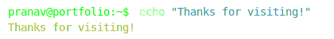

<div align="center">
  
</div>

<br>


#


#


[](https://github.com/Finova-MIT/finova-website)
[](https://github.com/pranavgnn/lyrics-video-maker)
[](https://github.com/pranavgnn/mutualfunds-calc)
[](https://github.com/pranavgnn/epicbot-js)

#


[LinkedIn](https://www.linkedin.com/in/pranav-g-nayak-a68101146) ⁝ [Instagram](https://www.instagram.com/pranav.idk) ⁝ [Discord](https://discord.com/users/vex.what)

```txt
📧 Email: pranavgnayak@gmail.com
🌐 Website: https://pranavgn.me
📱 Social: Links to connect with me above
```

#

