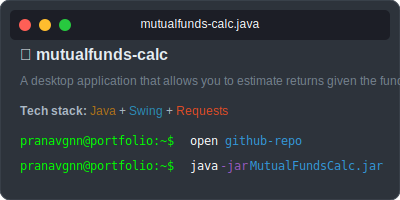

<div align="center">
  
</div>

<br>

<div align="center">
  
</div>

## About Me

<div align="center">
  
</div>

```txt
👋 Hello! I'm Pranav, a developer passionate about programming.

💻 My skills include fullstack development, scraping, software development and automation.

🚀 Currently working on website development and automation optimization.

🌱 I'm always learning and exploring new technologies.

🎓 2nd year BTech student pursuing Computer Science and Financial Technology @ Manipal Institute of Technology, and Integrated MTech in entrepreneurship.
```

## Projects

<div align="center">
  
</div>

<div align="center" style="display: flex; flex-wrap: wrap; justify-content: center; gap: 20px; margin: 20px 0;">
  <div style="display: flex; flex-direction: column; align-items: center; margin-bottom: 20px;">
    
    <div style="display: flex; gap: 10px; margin-top: 10px;">
      <a href="https://github.com/Finova-MIT/finova-website" target="_blank">
        
      </a>
      <a href="https://www.finovamanipal.org" target="_blank">
        
      </a>
    </div>
  </div>
  
  <div style="display: flex; flex-direction: column; align-items: center; margin-bottom: 20px;">
    
    <div style="display: flex; gap: 10px; margin-top: 10px;">
      <a href="https://github.com/pranavgnn/lyrics-video-maker" target="_blank">
        
      </a>
    </div>
  </div>
  
  <div style="display: flex; flex-direction: column; align-items: center; margin-bottom: 20px;">
    
    <div style="display: flex; gap: 10px; margin-top: 10px;">
      <a href="https://github.com/pranavgnn/mutualfunds-calc" target="_blank">
        
      </a>
    </div>
  </div>
</div>

<div align="center">
  <small><i>Last updated: 2025-03-10 16:42:06 UTC by pranavgnn</i></small>
</div>

## Contact

<div align="center">
  
</div>

<div align="center">
  <a href="https://www.instagram.com/pranav.idk">
    
  </a>
  <a href="https://www.linkedin.com/in/pranav-g-nayak-a68101146">
    
  </a>
  <a href="https://pranavgn.me">
    
  </a>
  <a href="https://discord.com/users/vex.what">
    
  </a>
</div>

```txt
📧 Email: pranavgnayak@gmail.com
🌐 Website: https://pranavgn.me
📱 Social: Links to connect with me above
```

<div align="center">
  <pre style="background-color: #333; padding: 10px; border-radius: 5px; color: #00FF00; display: inline-block; text-align: left;">
    pranavgnn@portfolio:~$ <span style="color: #FFFFFF;">echo</span> <span style="color: #3498db;">"Thanks for visiting my profile!"</span>
  </pre>
</div>